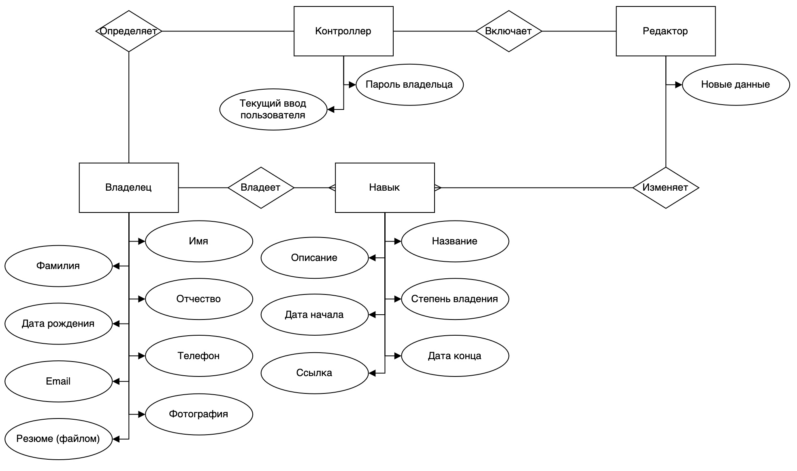
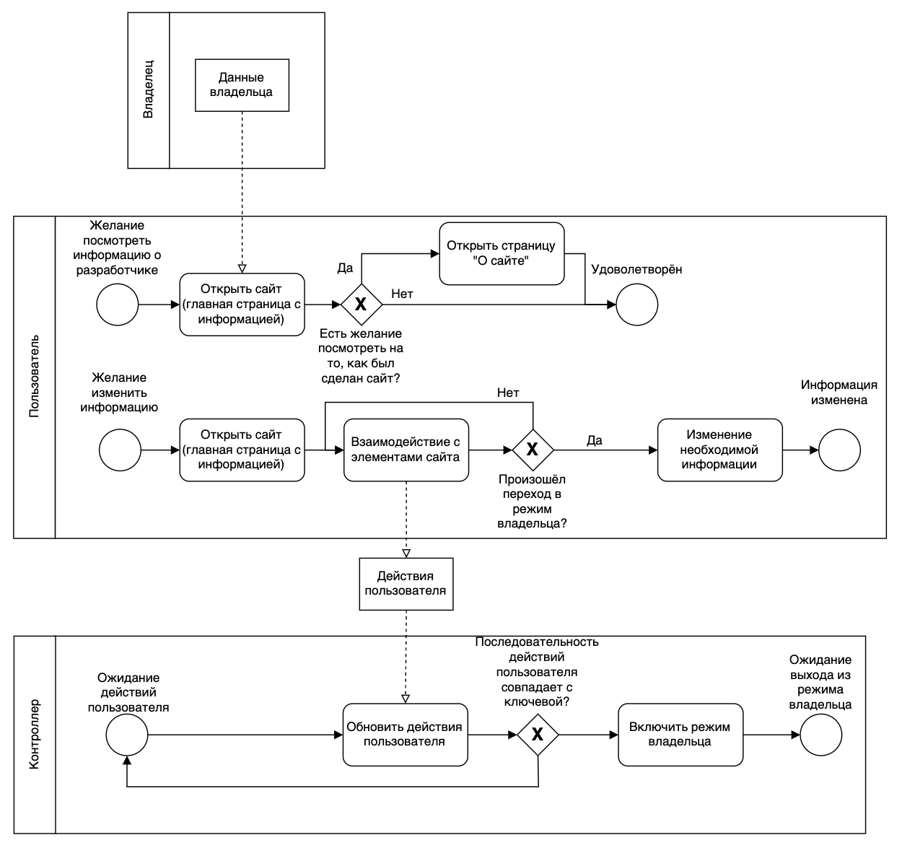

# Лабораторная работа №1, ППО

### Название: **Сайт-резюме**

### **Краткое описание идеи проекта**

WEB-приложение (SPA), на котором будет располагаться информация в виде резюме разработчика (сайт-визитка). Будет иметь 3 страницы:
1. Основная, с демонстрацией умений, навыков, опыта разработчика.
2. Дополнительная, с информацией о том, с использованием каких технологий был сделан данный сайт.

Содержимое основной страницы может иметь возможность редактировать содержимое в зависимости от того, является ли пользователь владельцем сайта.

### **Краткое описание предметной области**

Данное приложение предназначено для разработчика, желающего оформить своё резюме (визитку) в виде сделаннного собственными руками WEB-приложения

Сущности:
1. Владелец - сущность, описывающая владельца сайта (в том числе данные, по которым будет осуществляться идентификация, что пользователь является владельцем)
2. Навык - сущность, описывающая отдельный навык, которым может владеть (или нет) разработчик.
3. Контроллер - сущность, отслеживающая действия пользователя и способная понять, является ли пользователь владельцем.
4. Редактор - сущность, собирающая информацию в режиме владельца (и обновляющая информацию).

### **Краткий анализ  аналогичных решений по 3-м критериям**

|Название|Виртуально|Созданно собственноручно|Демонстративно|
|--------|----------|------------------------|--------------|
|Резюме-файл|+|+|-|
|Визитка|-|+|-|
|Шаблонный сайт-резюме|+|-|+|
|Сайт-резюме|+|+|+|

### **Краткое описание целесообразности и актуальности проекта**

Лучший способ, которым WEB-разработчик может продемонстрировать своему потенциальному нанимателю свои навыки, является сделанное своими руками WEB-приложение с использованием необходимых технологий. В объединении с идеей сайта-резюме (но не шаблонного, сгенерированного по алгоритму), данное WEB-приложение будет наиболее демонстративно с точки зрения воздействия на человека, просматривающего данный сайт.

### **Use-Case**

### **ER-diagram**

### **Пользовательские сценарии**

Пользователь может зайти на сайт приложения и:
1. Зайти на список жанров на основной странице.
2. Зайти на страницу конкретного жанра и посмотреть список фильмов, принадлежащих данному жанру.
3. Зайти на страницу конкретного фильма.
4. Зайти на страницу конкретного фильма, оставить рейтинг.
5. Зайти на страницу регистрации, зарегистрироваться или перейти на страницу авторизации.
6. Зайти на страницу авторизации, авторизироваться или перейти на страницу регистрации.
7. Авторизоваться, зайти на страницу своего профиля
8. Авторизоваться, зайти на страницу своего профиля, создать / удалить собственную подборку.
9. Авторизоваться, зайти на страницу конкретного фильма, добавить / исключить в собственную подборку.
10. Авторизоваться, сделать что-то из предыдущих действий или ни одно из них, выйти из аккаунта.

### **Формализация бизнес-правил, BPMN-диаграмма**

