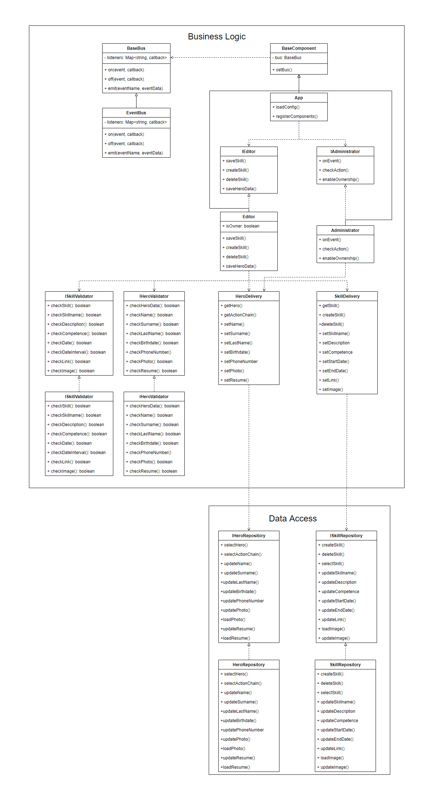

# Лабораторная работа №2, ППО

### **Описание типа приложения и технологического стека**
Приложение типа Web SPA, технологический стек: TypeScript, React.js, PostgreSQL

### **Верхнеуровневое разбиение на компоненты**

### **UML Component Diagram**

### **UML Class Diargram**
