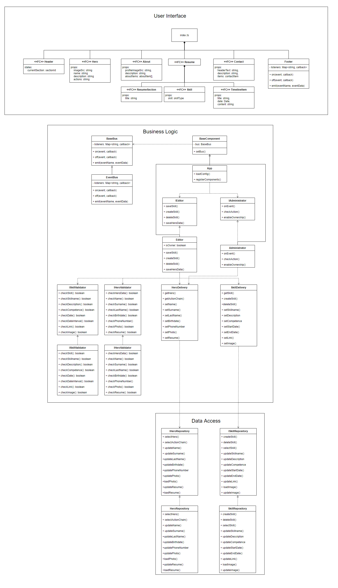

# Лабораторная работа №6, ППО

### **Программный код и точки входа**
В папке **src** лежат компоненты бэкенда и фронтенда (сейчас - консольное приложение, в дальшейшем - полноценное UI).

Сборка происходит в директории **dist** папок соответстующих компонентов, компонент может быть запущен из консоли с использованием **Node.js**.

### **Уточнённые диаграммы**

### **UML Component Diagram**

### **UML Class Diargram**
